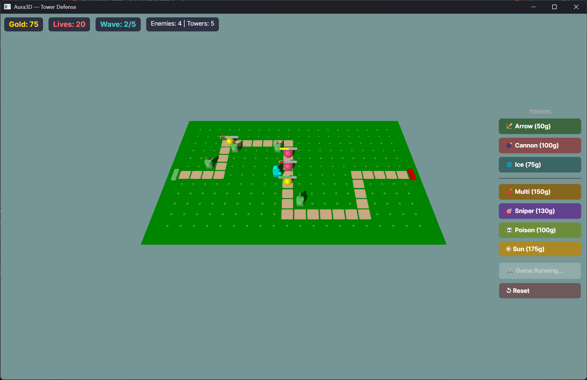

# Tower Defense 3D

[中文版](README_zh.md)

A 3D tower defense game built with [Avalonia UI](https://avaloniaui.net/) and [Aura3D](https://github.com/CeSun/Aura3D).

Place towers along a winding path to stop waves of enemies from reaching the exit. Manage gold, choose the right tower mix, and survive all 5 waves.



## Tech Stack

| Layer | Technology |
|---|---|
| UI Framework | Avalonia 12 + Fluent Theme |
| 3D Engine | Aura3D (Avalonia integration) |
| .NET | net10.0, C# |
| Platforms | Windows Desktop, Android |

## Project Structure

```
TowerDefense3D/
├── TowerDefense/              # Core game library
│   ├── GameData.cs            # Tower/Enemy definitions, runtime data
│   ├── GameManager.cs         # Core logic: waves, combat, pathfinding
│   ├── GameView.axaml         # UI layout (HUD, tower panel, overlays)
│   ├── GameView.axaml.cs      # 3D scene, input, model building, UI sync
│   ├── App.axaml / .cs        # Avalonia app entry
│   └── MainWindow.axaml / .cs # Main window shell
├── TowerDefense.Desktop/      # Windows Desktop launcher
├── TowerDefense.Android/      # Android launcher
└── TowerDefense3D.slnx        # Solution file
```

## Getting Started

### Prerequisites
- [.NET 10.0 SDK](https://dotnet.microsoft.com/download)

### Run (Desktop)

```bash
cd TowerDefense.Desktop
dotnet run
```

### Build

```bash
dotnet build
```

## How to Play

1. Click **Start Game** to begin wave 1
2. Click a **tower button** on the right to select a tower type
3. Click on a **green cell** on the map to place it (brown path cells are non-buildable)
4. Towers automatically attack enemies in range
5. Survive all 5 waves; lose all 20 lives and it's game over

### HUD

| Element | Description |
|---|---|
| 💰 Gold | Earned from kills; spent on towers |
| ❤️ Lives | Lost when enemies reach the exit |
| 🌊 Wave | Current wave / total waves |
| Status | Context hints and game info |

## Towers

### Basic

| Tower | Cost | DMG | Range | Speed | Special |
|---|---|---|---|---|---|
| 🏹 Arrow | 50g | 15 | 3.5 | 1.8/s | Fast, cheap single-target |
| 💣 Cannon | 100g | 40 | 3.0 | 0.6/s | Splash radius 1.5 |
| ❄️ Ice | 75g | 8 | 2.8 | 1.0/s | Slows enemies 50% |

### Advanced

| Tower | Cost | DMG | Range | Speed | Special |
|---|---|---|---|---|---|
| 🧨 Multi-Shot | 150g | 12×3 | 3.0 | 1.0/s | Fires 3 arrows in a 60° fan, each tracking a different enemy |
| 🎯 Sniper | 130g | 50 | 5.0 | 0.5/s | 30% chance to crit for ×3 damage; longest range |
| ☠️ Poison | 100g | 8 | 3.5 | 1.5/s | Applies DOT: 20 dmg/s for 3 seconds |
| ☀️ Sun | 175g | 18/s | 2.5 | — | Continuous AOE burn around the tower (no projectile) |

## Enemies

| Type | HP | Speed | Reward | Visual |
|---|---|---|---|---|
| Basic | 100 | 1.8 | 10g | 🔴 Crimson sphere |
| Fast | 60 | 3.5 | 15g | 🟡 Gold sphere |
| Tank | 350 | 1.0 | 30g | 🟣 Dark violet sphere (large) |

## Waves

| Wave | Enemies | Delay |
|---|---|---|
| 1 | 8× Basic | 3s |
| 2 | 6× Basic, 4× Fast | 15s |
| 3 | 8× Basic, 6× Fast, 2× Tank | 20s |
| 4 | 10× Fast, 4× Tank | 25s |
| 5 | 10× Basic, 8× Fast, 6× Tank | 30s |

## Map

- **20×12 grid**, each cell is 1 unit
- Brown path winds left → right through the grid
- Green cells are buildable
- Enemies spawn at the **left edge** (green marker) and exit at the **right edge** (red marker)

## License

MIT
